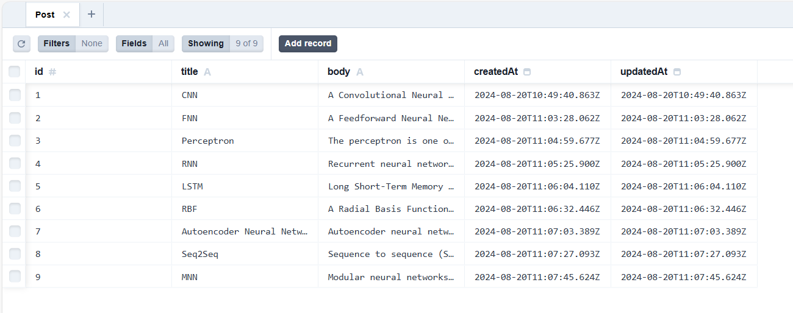

# Blog Project

## Overview

This project is a blog application built with various modern technologies. It features a home page with an introduction to neural networks, a posts page with detailed descriptions of different types of neural networks, and an authentication-protected page for creating new posts.

## Architecture

<p align="center">
  
</p>

## Technologies Used

### Next.js

<p align="center">
  
</p>
**Next.js** is a powerful React framework for building server-side rendered (SSR) and statically generated web applications. It simplifies routing and server-side rendering, making it ideal for building scalable and performant applications.

### TypeScript

<p align="center">
  
</p>
**TypeScript** is a statically typed superset of JavaScript that adds optional types. It helps catch errors early and improves code quality by enforcing type safety throughout the development process.

### Prisma + SQLite

<p align="center">
   
</p>

<p align="center">
  
</p>

**Prisma** is an ORM (Object-Relational Mapping) tool that provides a type-safe query builder for database management. **SQLite** is used as the database for this project, offering a lightweight and efficient solution for data storage.

### Kinde for Authentication

<p align="center">
  
</p>
**Kinde** is used for authentication and user management. It provides features for secure login, session management, and route protection, ensuring that only authorized users can create or modify posts.

### React

<p align="center">
  
</p>
**React** is a JavaScript library for building user interfaces. It allows for the creation of reusable components and enhances the development of interactive and dynamic web applications.

### React-Katex

**React-Katex** is a library for rendering LaTeX mathematical expressions within React components. It is used to display complex mathematical formulas clearly and accurately.

### Tailwind CSS

<p align="center">
  
</p>
**Tailwind CSS** is a utility-first CSS framework that provides low-level utility classes for creating custom designs. It facilitates rapid and responsive styling, making it easier to develop aesthetically pleasing UIs.

## Features

- **Home Page**: Introduction to neural networks and their features.
- **Posts Page**: Detailed descriptions of various types of neural networks.
- **Create Post Page**: Requires authentication to create new posts with titles and content.

## Screenshots

### Home Page

<p align="center">
  
</p>

### Posts Page

<p align="center">
  
  
  
</p>

### Create Post Page

<p align="center">
  
  
  
</p>

## Getting Started

First, run the development server:

```bash
npm run dev
# or
yarn dev
# or
pnpm dev
# or
bun dev


Open [http://localhost:3000](http://localhost:3000) with your browser to see the result.

You can start editing the page by modifying `app/page.tsx`. The page auto-updates as you edit the file.

This project uses [`next/font`](https://nextjs.org/docs/basic-features/font-optimization) to automatically optimize and load Inter, a custom Google Font.

## Learn More

To learn more about Next.js, take a look at the following resources:

- [Next.js Documentation](https://nextjs.org/docs) - learn about Next.js features and API.
- [Learn Next.js](https://nextjs.org/learn) - an interactive Next.js tutorial.

You can check out [the Next.js GitHub repository](https://github.com/vercel/next.js/) - your feedback and contributions are welcome!

## Deploy on Vercel

The easiest way to deploy your Next.js app is to use the [Vercel Platform](https://vercel.com/new?utm_medium=default-template&filter=next.js&utm_source=create-next-app&utm_campaign=create-next-app-readme) from the creators of Next.js.

Check out our [Next.js deployment documentation](https://nextjs.org/docs/deployment) for more details.
